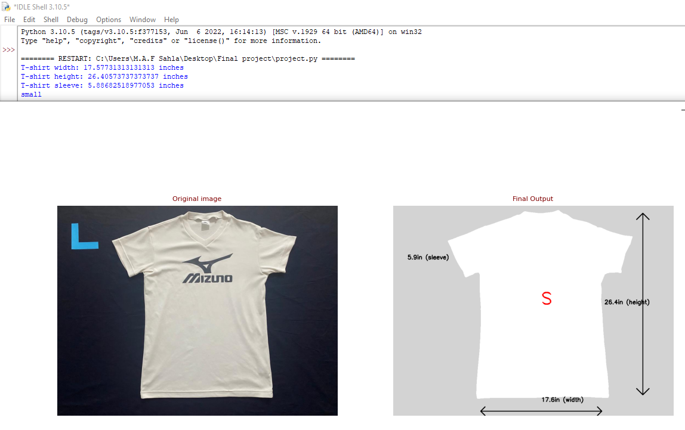

# T-Shirt-Size-Detection
Image Processing Project - OpenCV Python

T-Shirt size detection is an important aspect in the large-sclae T-Shirt
manufacturing companies as they need to label the T-shirts according to
their sizes, because sellers and buyers mostly refer the T-shirt fiton size by
looking at the T-Shirt size label in the T-Shirt.

## Tools and Technologies
* openCV
* NumPy
* Matplotlib
* Pyplot
* imutils
* scipy

## Image Processing Pipeline
1. Image input 
2. Convert to grayscale 
3. Gaussian blur 
4. Edge detection + Morphological operations 
5. Find contours and Sort them to find the T-Shirt 
6. Find image moments 
7. Create empty canvas for output image 
8. Examine contours and Calculate the measurements 
9. Display the Output image

## Final Output

